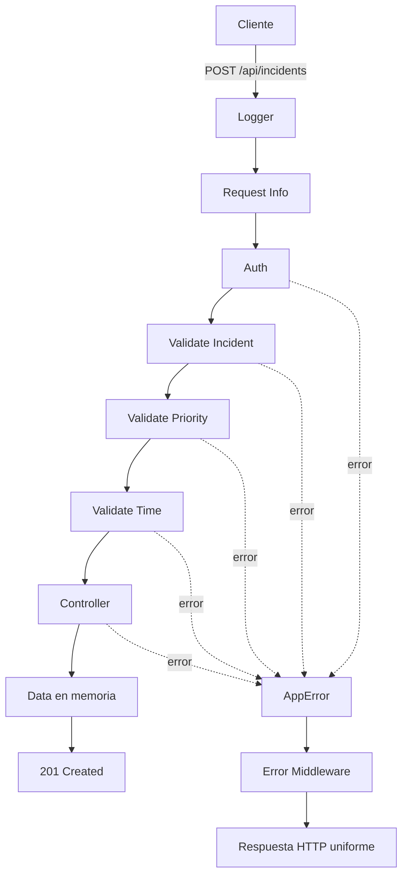

<div align="center">

# IncidentHub API

### API REST para la gestión de incidentes tecnológicos

*Proyecto Evaluable*

[](https://nodejs.org/)
[](https://www.typescriptlang.org/)
[](https://expressjs.com/)
[]()
[]()

</div>

---

## 📑 Tabla de contenido

1. [Descripción del proyecto](#1-descripción-del-proyecto)
2. [Problema que resuelve](#2-problema-que-resuelve)
3. [Características principales](#3-características-principales)
4. [Tecnologías utilizadas](#4-tecnologías-utilizadas)
5. [Arquitectura del proyecto](#5-arquitectura-del-proyecto)
6. [Instalación](#6-instalación)
7. [Ejecución](#7-ejecución)
8. [Modelo de datos: `Incident`](#8-modelo-de-datos-incident)
9. [Model vs DTO](#9-model-vs-dto)
10. [Documentación de endpoints](#10-documentación-de-endpoints)
    - [10.1 GET /api/incidents](#101-get-apiincidents)
    - [10.2 GET /api/incidents/:id](#102-get-apiincidentsid)
    - [10.3 POST /api/incidents](#103-post-apiincidents)
    - [10.4 PUT /api/incidents/:id](#104-put-apiincidentsid)
    - [10.5 PATCH /api/incidents/:id/status](#105-patch-apiincidentsidstatus)
    - [10.6 DELETE /api/incidents/:id](#106-delete-apiincidentsid)
    - [10.7 Endpoints especiales (Retos)](#107-endpoints-especiales-retos)
11. [Middlewares](#11-middlewares)
12. [Autenticación y autorización](#12-autenticación-y-autorización)
13. [Manejo centralizado de errores](#13-manejo-centralizado-de-errores)
14. [Flujo de una petición](#14-flujo-de-una-petición)
15. [Reglas de negocio especiales](#15-reglas-de-negocio-especiales)
16. [Evidencias de pruebas](#16-evidencias-de-pruebas)
17. [Reflexión: ¿por qué middlewares?](#17-reflexión-por-qué-middlewares)
18. [Control de versiones (Git)](#18-control-de-versiones-git)
19. [Autor](#19-autor)

---

## 1. Descripción del proyecto

**IncidentHub API** es una API REST desarrollada en **Node.js + TypeScript + Express** que permite registrar, consultar, actualizar, cambiar de estado y eliminar incidentes tecnológicos dentro de una organización. Es la primera versión (v1) del sistema y utiliza **persistencia en memoria** (arreglos de TypeScript), por lo que los datos se reinician cada vez que el servidor se reinicia.

El proyecto fue construido siguiendo una **arquitectura por capas**, separando claramente las responsabilidades entre modelos, DTOs, controladores, rutas, middlewares y manejo de errores, con el objetivo de demostrar buenas prácticas de organización en una API Express profesional.

---

## 2. Problema que resuelve

Actualmente, los incidentes tecnológicos de la organización (equipos que no encienden, fallas de conectividad, problemas con impresoras, aplicaciones caídas, etc.) se reportan de manera informal mediante llamadas, mensajes de texto y conversaciones verbales. Esto genera:

- ❌ Falta de trazabilidad de los incidentes reportados.
- ❌ Dificultad para priorizar incidentes urgentes o críticos.
- ❌ Ausencia de control sobre quién puede modificar o eliminar un registro.
- ❌ Imposibilidad de generar métricas o reportes reales.

**IncidentHub API** centraliza el registro y seguimiento de estos incidentes mediante una API estructurada, segura y con reglas de negocio claras, permitiendo llevar un control real del ciclo de vida de cada incidente: desde que se abre (`OPEN`) hasta que se resuelve (`RESOLVED`).

---

## 3. Características principales

| Característica | Descripción |
|---|---|
| ✅ CRUD completo | Crear, consultar, actualizar, cambiar estado y eliminar incidentes |
| ✅ Arquitectura por capas | Separación entre Model, DTO, Controller, Routes, Middlewares y Errors |
| ✅ Validaciones robustas | Middlewares dedicados para validar ID, datos, prioridad y tiempo estimado |
| ✅ Autenticación por token | Header `Authorization: Bearer <token>` |
| ✅ Autorización por roles | Técnico (`technician-token`) vs Administrador (`instructor-token`) |
| ✅ Manejo centralizado de errores | Clase `AppError` + middleware de errores uniforme |
| ✅ Máquina de estados | Control de transiciones válidas entre `OPEN`, `IN_PROGRESS` y `RESOLVED` |
| ✅ Endpoints analíticos | `/critical`, `/pending` y `/stats` con cálculos dinámicos |
| ✅ Logger de peticiones | Registro de cada solicitud entrante con fecha y ruta |

---

## 4. Tecnologías utilizadas

<div align="left">

| Tecnología | Uso en el proyecto |
|---|---|
| **Node.js** | Entorno de ejecución del servidor |
| **TypeScript** | Tipado estático, interfaces y seguridad en tiempo de compilación |
| **Express** | Framework HTTP para definir rutas y middlewares |
| **Thunder Client** | Herramienta utilizada para probar y documentar los endpoints |

</div>

## 5. Arquitectura del proyecto

```
incident_hub_api/
├── evidencias/
│   ├── img/                                       # Capturas de las 20 pruebas 
│   └── README.md                                  # Documento de evidencias
├── src/
│   ├── controllers/
│   │   └── incident.controller.ts                 # Lógica de negocio por endpoint
│   ├── data/
│   │   └── incidents.data.ts                      # Arreglo en memoria con los incidentes
│   ├── dtos/
│   │   └── incident.dto.ts                        # Contratos de entrada (Create/Update)
│   ├── errors/
│   │   └── app-error.ts                           # Clase de error controlado (AppError)
│   ├── middlewares/
│   │   ├── admin.middleware.ts                    # Autorización de administrador
│   │   ├── auth.middleware.ts                     # Autenticación por token
│   │   ├── error.middleware.ts                    # Manejo centralizado de errores
│   │   ├── logger.middleware.ts                   # Registro de peticiones
│   │   ├── not-found.middleware.ts                # Middleware 404 global
│   │   ├── request-info.middleware.ts             # Enriquecimiento del request
│   │   ├── validate-id.middleware.ts              # Validación de :id
│   │   ├── validate-incident.middleware.ts        # Validación de campos obligatorios
│   │   ├── validate-priority.middleware.ts        # Validación de priority
│   │   └── validate-time.middleware.ts            # Validación de estimatedMinutes
│   ├── models/
│   │   └── incident.model.ts                      # Interfaz Incident (modelo interno)
│   ├── routes/
│   │   └── incident.routes.ts                     # Definición de rutas
│   ├── app.ts                                     # Configuración de Express y middlewares globales
│   └── server.ts                                  # Arranque del servidor
├── package.json
├── tsconfig.json
└── README.md                         
```

## 6. Instalación

**Requisitos previos:**
- Node.js 18 o superior
- npm (incluido con Node.js)

**Pasos:**

```bash
# 1. Clonar el repositorio
git clone <URL-DEL-REPOSITORIO>

# 2. Entrar a la carpeta del proyecto
cd incident_hub_api

# 3. Instalar las dependencias
npm install
```

---

## 7. Ejecución

```bash
# Modo desarrollo (con recarga automática)
npm run dev
```

El servidor quedará disponible en:

```
http://localhost:3000
```

Todas las rutas de la API están bajo el prefijo:

```
http://localhost:3000/api/incidents
```

---

## 8. Modelo de datos: `Incident`

```ts
interface Incident {
  id: number;
  title: string;
  description: string;
  reporter: string;
  location: string;
  priority: "LOW" | "MEDIUM" | "HIGH" | "CRITICAL";
  status: "OPEN" | "IN_PROGRESS" | "RESOLVED";
  estimatedMinutes: number;
  createdAt: string;
}
```

**Ejemplo:**

```json
{
  "id": 1,
  "title": "Equipo sin acceso a Internet",
  "description": "El computador del laboratorio perdió completamente la conexión.",
  "reporter": "Laura Gómez",
  "location": "Laboratorio 304",
  "priority": "HIGH",
  "status": "OPEN",
  "estimatedMinutes": 45,
  "createdAt": "2026-09-18T14:30:00.000Z"
}
```

El proyecto inicia con **5 incidentes de ejemplo** precargados en `incidents.data.ts`, cubriendo distintos valores de `priority` y `status` para poder probar todos los escenarios desde el primer momento.

---

## 9. Model vs DTO

Uno de los puntos clave del proyecto es **no exponer directamente el modelo interno al cliente**. Para eso se usa un **DTO (Data Transfer Object)**, que define únicamente los campos que el cliente tiene permitido enviar.

| | **Model (`Incident`)** | **DTO (`CreateIncidentDto`)** |
|---|---|---|
| **¿Qué representa?** | Cómo existe el incidente dentro de la aplicación | Qué datos puede enviar el cliente para crear un incidente |
| **¿Quién lo genera?** | El servidor (id, status, createdAt) | El cliente, en el body de la petición |
| **Campos** | `id`, `title`, `description`, `reporter`, `location`, `priority`, `status`, `estimatedMinutes`, `createdAt` | `title`, `description`, `reporter`, `location`, `priority`, `estimatedMinutes` |

```ts
export interface CreateIncidentDto {
  title: string;
  description: string;
  reporter: string;
  location: string;
  priority: "LOW" | "MEDIUM" | "HIGH" | "CRITICAL";
  estimatedMinutes: number;
}
```

**En palabras propias:** el DTO actúa como un filtro de entrada. El cliente nunca controla el `id`, el `status` inicial ni la fecha de creación (`createdAt`); esos valores los asigna el servidor para garantizar que la información sea consistente y no pueda ser manipulada desde afuera. El `Model`, en cambio, es la representación completa del incidente una vez que ya vive dentro del sistema.

---

## 10. Documentación de endpoints

### 10.1 GET /api/incidents

Consulta todos los incidentes registrados.

| | |
|---|---|
| **Autenticación** | No requerida |
| **Respuesta exitosa** | `200 OK` |

```json
{
  "ok": true,
  "total": 5,
  "data": []
}
```

---

### 10.2 GET /api/incidents/:id

Consulta un incidente puntual por su `id`.

| | |
|---|---|
| **Autenticación** | No requerida |
| **Respuesta exitosa** | `200 OK` |
| **Errores** | `400 Bad Request` (id inválido) · `404 Not Found` (no existe) |

```json
// 404
{
  "ok": false,
  "message": "Incident not found"
}
```

```json
// 400
{
  "ok": false,
  "message": "Invalid incident id"
}
```

---

### 10.3 POST /api/incidents

Registra un nuevo incidente.

| | |
|---|---|
| **Autenticación** | Requerida (`technician-token` o `instructor-token`) |
| **Respuesta exitosa** | `201 Created` |
| **Errores** | `400 Bad Request` (datos inválidos, prioridad inválida, tiempo inválido, o regla CRITICAL) |

**Body:**
```json
{
  "title": "Pantalla con parpadeos",
  "description": "El monitor presenta parpadeos constantes.",
  "reporter": "Miguel Torres",
  "location": "Oficina 407",
  "priority": "MEDIUM",
  "estimatedMinutes": 35
}
```

El servidor agrega automáticamente `id`, `status: "OPEN"` y `createdAt`.

---

### 10.4 PUT /api/incidents/:id

Actualiza un incidente existente. El `id` **no puede ser modificado**.

| | |
|---|---|
| **Autenticación** | No requerida en esta versión |
| **Respuesta exitosa** | `200 OK` |
| **Errores** | `404 Not Found` |

**Body:**
```json
{
  "title": "Pantalla sin imagen",
  "description": "El monitor dejó completamente de mostrar imagen.",
  "location": "Oficina 407",
  "priority": "HIGH",
  "estimatedMinutes": 60
}
```

---

### 10.5 PATCH /api/incidents/:id/status

Cambia el estado de un incidente, respetando las transiciones permitidas (ver [Reglas de negocio especiales](#15-reglas-de-negocio-especiales)).

| | |
|---|---|
| **Autenticación** | No requerida en esta versión |
| **Respuesta exitosa** | `200 OK` |
| **Errores** | `400 Bad Request` (estado inválido o transición no permitida) · `404 Not Found` |

**Body:**
```json
{
  "status": "IN_PROGRESS"
}
```

Valores permitidos: `OPEN`, `IN_PROGRESS`, `RESOLVED`.

---

### 10.6 DELETE /api/incidents/:id

Elimina un incidente. **Endpoint protegido**: solo un administrador puede ejecutarlo.

| | |
|---|---|
| **Autenticación** | Requerida |
| **Autorización** | Solo `instructor-token` |
| **Respuesta exitosa** | `204 No Content` |
| **Errores** | `401 Unauthorized` (sin token) · `403 Forbidden` (token de técnico) · `404 Not Found` |

```bash
curl -X DELETE http://localhost:3000/api/incidents/3 \
  -H "Authorization: Bearer instructor-token"
```

---

### 10.7 Endpoints especiales (Retos)

| Endpoint | Descripción | Respuesta |
|---|---|---|
| `GET /api/incidents/critical` | Retorna únicamente los incidentes con `priority: "CRITICAL"` | `200 OK` |
| `GET /api/incidents/pending` | Retorna incidentes con estado `OPEN` o `IN_PROGRESS` (excluye `RESOLVED`) | `200 OK` |
| `GET /api/incidents/stats` | Calcula dinámicamente métricas operacionales | `200 OK` |

**Ejemplo de respuesta de `/stats`:**

```json
{
  "ok": true,
  "data": {
    "total": 12,
    "open": 5,
    "inProgress": 4,
    "resolved": 3,
    "critical": 2,
    "averageEstimatedMinutes": 47
  }
}
```

---

## 11. Middlewares

| Middleware | Función |
|---|---|
| **`logger.middleware.ts`** | Registra en consola cada petición entrante, con marca de tiempo, método y ruta. Es el primer middleware en ejecutarse. |
| **`request-info.middleware.ts`** | Enriquece el objeto `req` agregando `req.requestInfo` (timestamp, método y path), demostrando cómo un middleware puede añadir información antes de llegar al controlador. |
| **`auth.middleware.ts`** | Verifica que la petición incluya un header `Authorization: Bearer <token>` válido (`technician-token` o `instructor-token`). Si falta o es inválido, responde `401 Unauthorized`. |
| **`admin.middleware.ts`** | Verifica que el token pertenezca a un administrador (`instructor-token`) antes de permitir operaciones sensibles como `DELETE`. Si el token es de técnico, responde `403 Forbidden`. |
| **`validate-id.middleware.ts`** | Valida que el parámetro `:id` de la URL sea un número entero positivo. Rechaza valores como `abc`, `-3` o `4.5` con `400 Bad Request`. |
| **`validate-incident.middleware.ts`** | Valida que el body de la petición contenga los campos obligatorios (`title`, `description`, `reporter`, `location`, `priority`, `estimatedMinutes`) antes de llegar al controlador. |
| **`validate-priority.middleware.ts`** | Verifica que `priority` sea uno de los valores permitidos (`LOW`, `MEDIUM`, `HIGH`, `CRITICAL`). |
| **`validate-time.middleware.ts`** | Verifica que `estimatedMinutes` sea numérico, mayor que 0 y no supere los 480 minutos. |
| **`not-found.middleware.ts`** | Middleware global de cierre: captura cualquier ruta no definida en la aplicación y responde `404 Not Found` con un mensaje uniforme. |
| **`error.middleware.ts`** | Middleware de manejo centralizado de errores. Captura cualquier `AppError` lanzado en controladores o middlewares anteriores y lo transforma en una respuesta HTTP consistente. |

---

## 12. Autenticación y autorización

El proyecto implementa un esquema simple de autenticación basado en **tokens estáticos** enviados por header (sin JWT):

```
Authorization: Bearer instructor-token
Authorization: Bearer technician-token
```

| Token | Rol | Permisos |
|---|---|---|
| `instructor-token` | Administrador | Acceso completo, incluyendo `DELETE` |
| `technician-token` | Técnico | Puede usar `GET`, `POST`, `PUT` y `PATCH`, **no** puede eliminar |
| *(sin token / token inválido)* | — | `401 Unauthorized` en rutas protegidas |

Si un técnico intenta eliminar un incidente, la respuesta es `403 Forbidden`.

---

## 13. Manejo centralizado de errores

Se implementó una clase `AppError` que representa errores controlados de la aplicación:

```ts
export class AppError extends Error {
  constructor(
    public statusCode: number,
    message: string
  ) {
    super(message);
  }
}
```

Los controladores lanzan errores de forma consistente, sin repetir `res.status(...).json(...)` en cada caso:

```ts
throw new AppError(404, "Incident not found");
```

El **error middleware** intercepta cualquier error lanzado en la cadena de middlewares/controladores y responde siempre con el mismo formato:

```json
{
  "ok": false,
  "message": "Incident not found"
}
```

---

## 14. Flujo de una petición



---

## 15. Reglas de negocio especiales

### 🔺 Regla CRITICAL (Reto 4)

Cuando `priority` es `CRITICAL`, `estimatedMinutes` **no puede superar los 60 minutos**. Un incidente crítico con más de 60 minutos estimados es rechazado con `400 Bad Request`.

> **Decisión técnica:** esta validación se implementó a nivel de middleware de validación (junto a `validate-time`/`validate-incident`), para mantener al controlador libre de reglas de negocio de bajo nivel y conservar la filosofía de "el controlador no valida, solo orquesta".

### 🔁 Máquina de estados (Reto 5)

Solo se permiten las siguientes transiciones de estado:

```
OPEN → IN_PROGRESS → RESOLVED
OPEN → RESOLVED
```

❌ **No permitido:**

```
RESOLVED → OPEN
RESOLVED → IN_PROGRESS
```

Cualquier transición no permitida responde `400 Bad Request` con un mensaje descriptivo (por ejemplo: `"Invalid state transition from RESOLVED to OPEN"`).

---

## 16. Evidencias de pruebas

Las 20 pruebas obligatorias de la Sección 14 de la guía, junto con sus capturas de pantalla realizadas en **Thunder Client**, se encuentran documentadas en:

```
evidencias/README.md
evidencias/img/
```

---

## 17. Reflexión: ¿por qué middlewares?

> *Pregunta obligatoria de la guía: ¿qué ventajas ofrece implementar validaciones, autenticación y manejo de errores mediante middlewares en lugar de escribir toda esta lógica directamente dentro de cada controller?*

Implementar estas responsabilidades como middlewares independientes permite que cada controlador se enfoque únicamente en la lógica de negocio propia del endpoint, sin mezclarse con validaciones repetitivas de autenticación o formato de datos. Esto hace que el código sea más fácil de leer, de mantener y de probar por separado, ya que cada middleware cumple una única función y puede reutilizarse en distintas rutas sin duplicar lógica. Además, si en el futuro cambia una regla de validación o el esquema de autenticación, el cambio se hace en un solo lugar en vez de modificar cada controlador uno por uno, reduciendo el riesgo de inconsistencias entre endpoints.

*(Este apartado puede ampliarse o personalizarse con tus propias palabras antes de la entrega final.)*

---

## 18. Control de versiones (Git)

El repositorio refleja avances incrementales mediante commits organizados por funcionalidad:

```bash
git commit -m "chore: initialize TypeScript Express project"
git commit -m "feat: add incident model and DTO"
git commit -m "feat: implement incident controller"
git commit -m "feat: add validation middlewares"
git commit -m "feat: add authentication and authorization"
git commit -m "feat: add centralized error handling"
git commit -m "docs: add API documentation"
```

---

## 19. Autor

<div align="center">

**Jonathan Andrés Jiménez Aguilera**

Proyecto Evaluable — Capítulo V · IncidentHub API v1

</div>