# Evidencias de Pruebas — IncidentHub API v1

## Índice

1. [Información general](#1-información-general)
2. [Herramienta utilizada](#2-herramienta-utilizada)
3. [Estructura de la carpeta de evidencias](#3-estructura-de-la-carpeta-de-evidencias)
4. [Resumen general de pruebas](#4-resumen-general-de-pruebas)
5. [Pruebas de Consulta (GET)](#5-pruebas-de-consulta-get)
   - [5.1 GET todos los incidentes](#51-get-todos-los-incidentes)
   - [5.2 GET incidente existente](#52-get-incidente-existente)
   - [5.3 GET incidente inexistente](#53-get-incidente-inexistente)
   - [5.4 GET con ID inválido (abc)](#54-get-con-id-inválido-abc)
6. [Pruebas de Creación (POST)](#6-pruebas-de-creación-post)
   - [6.1 POST válido](#61-post-válido)
   - [6.2 POST sin título](#62-post-sin-título)
   - [6.3 POST prioridad inválida](#63-post-prioridad-inválida)
   - [6.4 POST estimatedMinutes negativo](#64-post-estimatedminutes-negativo)
   - [6.5 POST CRITICAL > 60 min (Reto 4)](#65-post-critical--60-min-reto-4)
7. [Pruebas de Actualización (PUT)](#7-pruebas-de-actualización-put)
   - [7.1 PUT existente](#71-put-existente)
   - [7.2 PUT inexistente](#72-put-inexistente)
8. [Pruebas de Cambio de Estado (PATCH)](#8-pruebas-de-cambio-de-estado-patch)
   - [8.1 PATCH OPEN → IN_PROGRESS](#81-patch-open--in_progress)
   - [8.2 PATCH IN_PROGRESS → RESOLVED](#82-patch-in_progress--resolved)
   - [8.3 PATCH RESOLVED → OPEN (Reto 5)](#83-patch-resolved--open-reto-5)
9. [Pruebas de Eliminación y Seguridad (DELETE)](#9-pruebas-de-eliminación-y-seguridad-delete)
   - [9.1 DELETE sin token](#91-delete-sin-token)
   - [9.2 DELETE con technician-token](#92-delete-con-technician-token)
   - [9.3 DELETE con instructor-token](#93-delete-con-instructor-token)
10. [Pruebas de Rutas Especiales y Errores Globales](#10-pruebas-de-rutas-especiales-y-errores-globales)
    - [10.1 Ruta inexistente](#101-ruta-inexistente)
    - [10.2 GET /critical (Reto 1)](#102-get-critical-reto-1)
    - [10.3 GET /stats (Reto 3)](#103-get-stats-reto-3)
11. [Conclusiones](#11-conclusiones)

---

## 1. Información general

| Campo                  | Detalle                          |
| ---------------------- | -------------------------------- |
| **Proyecto**           | IncidentHub API v1               |
| **Autor**              | Jonathan Andrés Jiménez Aguilera |
| **Tecnologías**        | Node.js, TypeScript, Express     |
| **Persistencia**       | En memoria (arrays)              |
| **Puerto local**       | `http://localhost:3000`          |
| **Repositorio GitHub** | _(enlace al repositorio)_        |

---

## 2. Herramienta utilizada

**Thunder Client**

Cada prueba de este documento indica exactamente qué configurar en Thunder Client:

- **Method:** el verbo HTTP a seleccionar en el desplegable (GET, POST, PUT, PATCH, DELETE).
- **URL:** la dirección a pegar en la barra de la petición.
- **Headers:** pestaña **Headers** de Thunder Client — clave y valor a agregar.
- **Body → JSON:** pestaña **Body**, seleccionar tipo `JSON`, y pegar el objeto indicado.

---

## 3. Estructura de la carpeta de evidencias

Las capturas están numeradas en el mismo orden de la tabla de la Sección 14 y se ubican en la carpeta `img/`, para que la evidencia sea fácilmente trazable:

```
img/
├── 01-get-todos-los-incidentes.png
├── 02-get-incidente-existente.png
├── 03-get-incidente-inexistente.png
├── 04-get-id-invalido.png
├── 05-post-valido.png
├── 06-post-sin-titulo.png
├── 07-post-prioridad-invalida.png
├── 08-post-estimatedminutes-negativo.png
├── 09-post-critical-mayor-60min.png
├── 10-put-existente.png
├── 11-put-inexistente.png
├── 12-patch-open-a-inprogress.png
├── 13-patch-inprogress-a-resolved.png
├── 14-patch-resolved-a-open.png
├── 15-delete-sin-token.png
├── 16-delete-technician-token.png
├── 17-delete-instructor-token.png
├── 18-ruta-inexistente.png
├── 19-get-critical.png
└── 20-get-stats.png
```

---

## 4. Resumen general de pruebas

| #   | Prueba                           | Método | Resultado esperado | Resultado obtenido | Estado |
| --- | -------------------------------- | ------ | ------------------ | ------------------ | ------ |
| 1   | GET todos los incidentes         | GET    | 200 OK             | 200 OK             | ✅     |
| 2   | GET incidente existente          | GET    | 200 OK             | 200 OK             | ✅     |
| 3   | GET incidente inexistente        | GET    | 404 Not Found      | 404 Not Found      | ✅     |
| 4   | GET con ID `abc`                 | GET    | 400 Bad Request    | 400 Bad Request    | ✅     |
| 5   | POST válido                      | POST   | 201 Created        | 201 Created        | ✅     |
| 6   | POST sin título                  | POST   | 400 Bad Request    | 400 Bad Request    | ✅     |
| 7   | POST prioridad inválida          | POST   | 400 Bad Request    | 400 Bad Request    | ✅     |
| 8   | POST `estimatedMinutes` negativo | POST   | 400 Bad Request    | 400 Bad Request    | ✅     |
| 9   | POST CRITICAL > 60 min           | POST   | 400 Bad Request    | 400 Bad Request    | ✅     |
| 10  | PUT existente                    | PUT    | 200 OK             | 200 OK             | ✅     |
| 11  | PUT inexistente                  | PUT    | 404 Not Found      | 404 Not Found      | ✅     |
| 12  | PATCH OPEN → IN_PROGRESS         | PATCH  | 200 OK             | 200 OK             | ✅     |
| 13  | PATCH IN_PROGRESS → RESOLVED     | PATCH  | 200 OK             | 200 OK             | ✅     |
| 14  | PATCH RESOLVED → OPEN            | PATCH  | 400 Bad Request    | 400 Bad Request    | ✅     |
| 15  | DELETE sin token                 | DELETE | 401 Unauthorized   | 401 Unauthorized   | ✅     |
| 16  | DELETE con `technician-token`    | DELETE | 403 Forbidden      | 403 Forbidden      | ✅     |
| 17  | DELETE con `instructor-token`    | DELETE | 204 No Content     | 204 No Content     | ✅     |
| 18  | Ruta inexistente                 | GET    | 404 Not Found      | 404 Not Found      | ✅     |
| 19  | GET `/critical` (Reto 1)         | GET    | 200 OK             | 200 OK             | ✅     |
| 20  | GET `/stats` (Reto 3)            | GET    | 200 OK             | _(pendiente)_      | ⬜     |

---

## 5. Pruebas de Consulta (GET)

### 5.1 GET todos los incidentes

**Explicación:** esta prueba confirma que el endpoint principal de consulta devuelve la lista completa de incidentes registrados, junto con el total, sin necesidad de autenticación.

**Configuración en Thunder Client:**

- **Method:** `GET`
- **URL:** `http://localhost:3000/api/incidents`
- **Headers:** ninguno
- **Body:** ninguno

**Resultado esperado:** `200 OK`

```json
{
  "ok": true,
  "total": 5,
  "data": []
}
```

**Resultado obtenido:** `200 OK` — `1.36 KB` — `44 ms`

```json
{
  "ok": true,
  "total": 5,
  "data": [
    {
      "id": 1,
      "title": "Proyector reparado",
      "description": "Se ajustó el cable HDMI",
      "reporter": "Carlos Díaz",
      "location": "Aula 201",
      "priority": "LOW",
      "status": "RESOLVED",
      "estimatedMinutes": 15,
      "createdAt": "2026-09-23T02:19:39.447Z"
    },
    {
      "id": 3,
      "title": "Atasco de papel en impresora",
      "description": "La impresora multifuncional se bloquea al imprimir en dúplex.",
      "reporter": "Juan Ruiz",
      "location": "Biblioteca",
      "priority": "LOW",
      "status": "RESOLVED",
      "estimatedMinutes": 20,
      "createdAt": "2026-09-23T02:19:39.450Z"
    },
    {
      "id": 4,
      "title": "Servidor local sin acceso SSH",
      "description": "El nodo de pruebas principal rechaza las conexiones remotas.",
      "reporter": "Ana Gomez",
      "location": "Sala de Servidores",
      "priority": "CRITICAL",
      "status": "OPEN",
      "estimatedMinutes": 50,
      "createdAt": "2026-09-23T02:19:39.450Z"
    },
    {
      "id": 5,
      "title": "Teclado dañado en puesto de trabajo",
      "description": "Varias teclas numéricas no responden al escribir.",
      "reporter": "Luis Castro",
      "location": "Oficina 305",
      "priority": "LOW",
      "status": "OPEN",
      "estimatedMinutes": 15,
      "createdAt": "2026-09-23T02:19:39.450Z"
    },
    {
      "id": 6,
      "title": "Falla de red",
      "description": "Sin acceso al switch",
      "reporter": "Luis Perez",
      "location": "Sala 1",
      "priority": "MEDIUM",
      "status": "OPEN",
      "estimatedMinutes": 30,
      "createdAt": "2026-09-23T02:58:09.877Z"
    }
  ]
}
```

**Evidencia:**

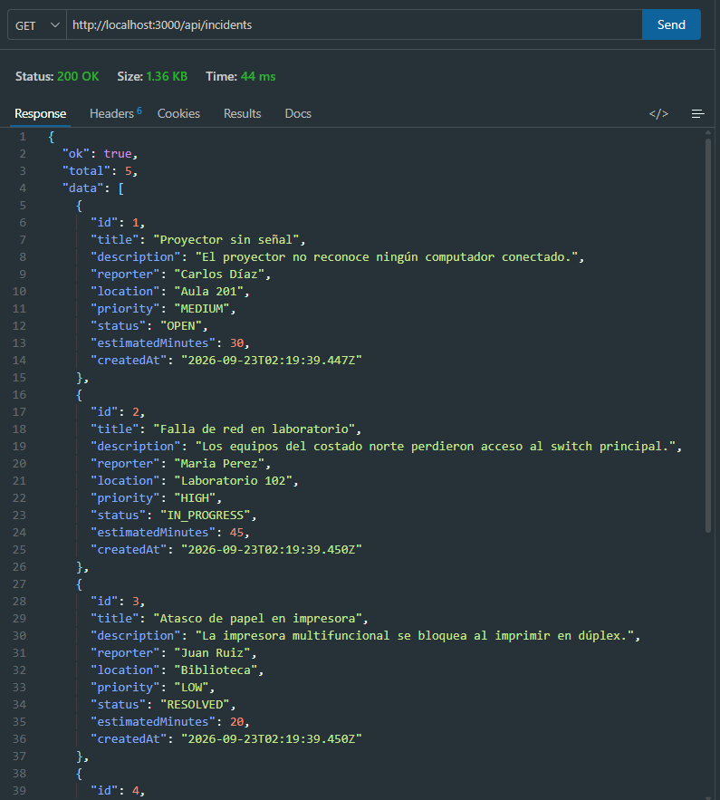

---

### 5.2 GET incidente existente

**Explicación:** valida que se puede consultar un incidente específico usando un `id` numérico que sí existe en los datos.

**Configuración en Thunder Client:**

- **Method:** `GET`
- **URL:** `http://localhost:3000/api/incidents/1`
- **Headers:** ninguno
- **Body:** ninguno

**Resultado esperado:** `200 OK` con el objeto del incidente.

**Resultado obtenido:** `200 OK` — `274 Bytes` — `10 ms`

```json
{
  "ok": true,
  "data": {
    "id": 1,
    "title": "Proyector sin señal",
    "description": "El proyector no reconoce ningún computador conectado.",
    "reporter": "Carlos Díaz",
    "location": "Aula 201",
    "priority": "MEDIUM",
    "status": "OPEN",
    "estimatedMinutes": 30,
    "createdAt": "2026-09-23T02:19:39.447Z"
  }
}
```

**Evidencia:**

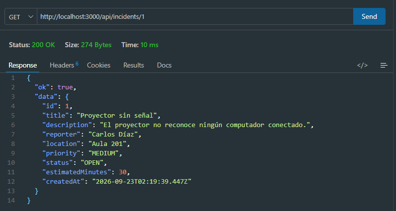

---

### 5.3 GET incidente inexistente

**Explicación:** comprueba el manejo del error cuando el `id` tiene un formato válido (número) pero no corresponde a ningún incidente almacenado.

**Configuración en Thunder Client:**

- **Method:** `GET`
- **URL:** `http://localhost:3000/api/incidents/999`
- **Headers:** ninguno
- **Body:** ninguno

**Resultado esperado:** `404 Not Found`

```json
{
  "ok": false,
  "message": "Incident not found"
}
```

**Resultado obtenido:** `404 Not Found` — `43 Bytes` — `7 ms`

```json
{
  "ok": false,
  "message": "Incident not found"
}
```

**Evidencia:**

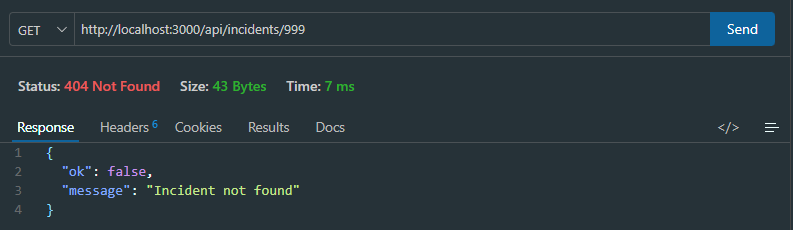

---

### 5.4 GET con ID inválido (abc)

**Explicación:** valida que el middleware `validateId` detiene la petición cuando el parámetro de la URL no es un número entero positivo.

**Configuración en Thunder Client:**

- **Method:** `GET`
- **URL:** `http://localhost:3000/api/incidents/abc`
- **Headers:** ninguno
- **Body:** ninguno

**Resultado esperado:** `400 Bad Request`

```json
{
  "ok": false,
  "message": "Invalid incident id"
}
```

**Resultado obtenido:** `400 Bad Request` — `44 Bytes` — `10 ms`

```json
{
  "ok": false,
  "message": "Invalid incident id"
}
```

**Evidencia:**

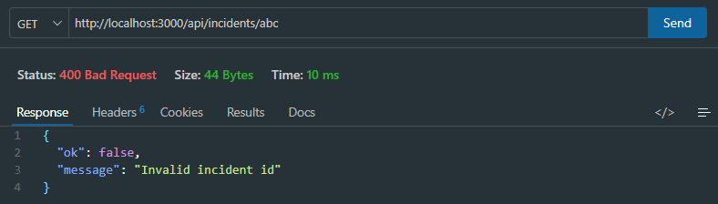

---

## 6. Pruebas de Creación (POST)

### 6.1 POST válido

**Explicación:** registra un nuevo incidente enviando todos los campos obligatorios y un token de técnico válido. El servidor debe generar automáticamente `id`, `status` (`OPEN`) y `createdAt`.

**Configuración en Thunder Client:**

- **Method:** `POST`
- **URL:** `http://localhost:3000/api/incidents`
- **Headers:**
  - `Content-Type: application/json`
  - `Authorization: Bearer technician-token`
- **Body → JSON:**

```json
{
  "title": "Falla de red",
  "description": "Sin acceso al switch",
  "reporter": "Luis Perez",
  "location": "Sala 1",
  "priority": "MEDIUM",
  "estimatedMinutes": 30
}
```

**Resultado esperado:** `201 Created`, con `id`, `status: "OPEN"` y `createdAt` generados por el servidor.

**Resultado obtenido:** `201 Created` — `228 Bytes` — `58 ms`

```json
{
  "ok": true,
  "data": {
    "id": 6,
    "title": "Falla de red",
    "description": "Sin acceso al switch",
    "reporter": "Luis Perez",
    "location": "Sala 1",
    "priority": "MEDIUM",
    "status": "OPEN",
    "estimatedMinutes": 30,
    "createdAt": "2026-09-23T02:58:09.877Z"
  }
}
```

**Evidencia:**

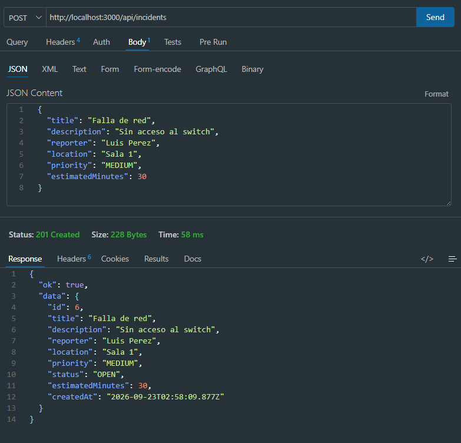

---

### 6.2 POST sin título

**Explicación:** verifica que `validateIncident` rechaza la petición cuando falta el campo obligatorio `title`, deteniéndola antes de llegar al controller.

**Configuración en Thunder Client:**

- **Method:** `POST`
- **URL:** `http://localhost:3000/api/incidents`
- **Headers:**
  - `Content-Type: application/json`
- **Body → JSON:**

```json
{
  "description": "Sin título",
  "reporter": "Luis",
  "location": "Sala 1",
  "priority": "MEDIUM",
  "estimatedMinutes": 30
}
```

**Resultado esperado:** `400 Bad Request`

**Resultado obtenido:** `400 Bad Request` — `57 Bytes` — `8 ms`

```json
{
  "ok": false,
  "message": "Missing required incident fields"
}
```

**Evidencia:**

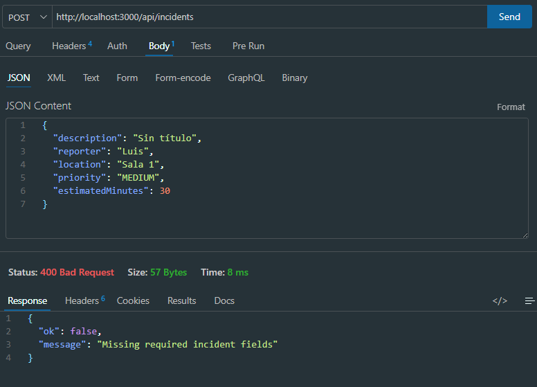

---

### 6.3 POST prioridad inválida

**Explicación:** comprueba que `validatePriority` solo acepta `LOW`, `MEDIUM`, `HIGH` y `CRITICAL`, rechazando cualquier otro valor.

**Configuración en Thunder Client:**

- **Method:** `POST`
- **URL:** `http://localhost:3000/api/incidents`
- **Headers:**
  - `Content-Type: application/json`
- **Body → JSON:**

```json
{
  "title": "Test",
  "description": "Test",
  "reporter": "Luis",
  "location": "Sala 1",
  "priority": "SUPER_IMPORTANT",
  "estimatedMinutes": 30
}
```

**Resultado esperado:** `400 Bad Request`

**Resultado obtenido:** `400 Bad Request` — `47 Bytes` — `9 ms`

```json
{
  "ok": false,
  "message": "Invalid priority value"
}
```

**Evidencia:**

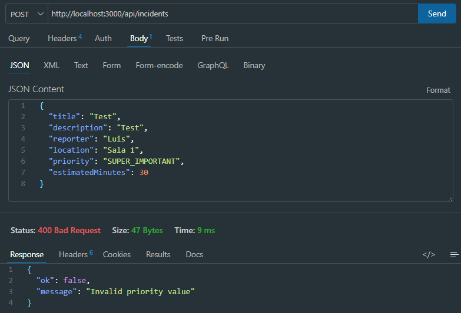

---

### 6.4 POST estimatedMinutes negativo

**Explicación:** valida que `validateTime` rechaza valores de `estimatedMinutes` menores o iguales a 0.

**Configuración en Thunder Client:**

- **Method:** `POST`
- **URL:** `http://localhost:3000/api/incidents`
- **Headers:**
  - `Content-Type: application/json`
- **Body → JSON:**

```json
{
  "title": "Test",
  "description": "Test",
  "reporter": "Luis",
  "location": "Sala 1",
  "priority": "LOW",
  "estimatedMinutes": -10
}
```

**Resultado esperado:** `400 Bad Request`

**Resultado obtenido:** `400 Bad Request` — `65 Bytes` — `7 ms`

```json
{
  "ok": false,
  "message": "Estimated minutes must be greater than 0"
}
```

**Evidencia:**

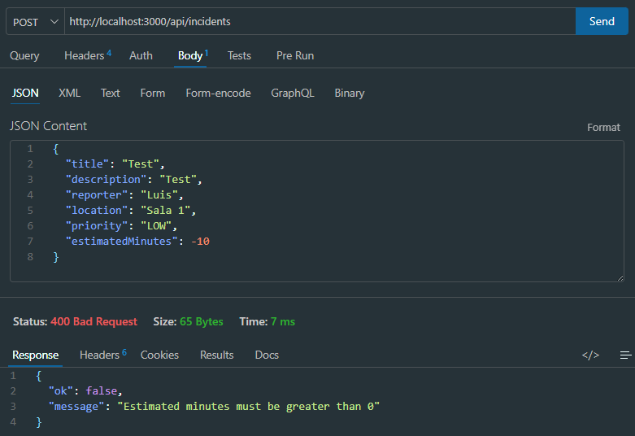

---

### 6.5 POST CRITICAL > 60 min (Reto 4)

**Explicación:** confirma la regla especial del Reto 4: cuando `priority` es `CRITICAL`, `estimatedMinutes` no puede superar 60.

**Configuración en Thunder Client:**

- **Method:** `POST`
- **URL:** `http://localhost:3000/api/incidents`
- **Headers:**
  - `Content-Type: application/json`
- **Body → JSON:**

```json
{
  "title": "Incendio",
  "description": "Fuego en rack",
  "reporter": "Jefe",
  "location": "Server",
  "priority": "CRITICAL",
  "estimatedMinutes": 120
}
```

**Resultado esperado:** `400 Bad Request`

**Resultado obtenido:** `400 Bad Request` — `78 Bytes` — `8 ms`

```json
{
  "ok": false,
  "message": "Critical incidents cannot exceed 60 estimated minutes"
}
```

**Evidencia:**

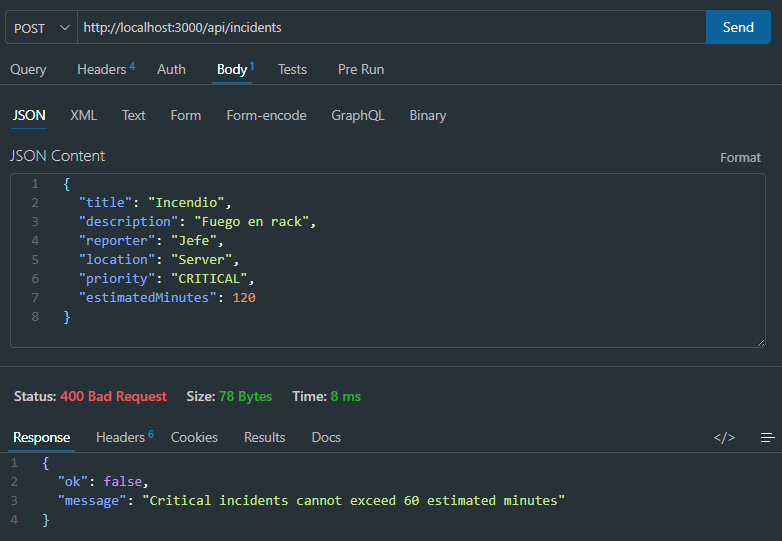

---

## 7. Pruebas de Actualización (PUT)

### 7.1 PUT existente

**Explicación:** actualiza los datos de un incidente ya registrado. El `id` no debe cambiar tras la actualización.

**Configuración en Thunder Client:**

- **Method:** `PUT`
- **URL:** `http://localhost:3000/api/incidents/1`
- **Headers:**
  - `Content-Type: application/json`
- **Body → JSON:**

```json
{
  "title": "Proyector reparado",
  "description": "Se ajustó el cable HDMI",
  "location": "Aula 201",
  "priority": "LOW",
  "estimatedMinutes": 15
}
```

**Resultado esperado:** `200 OK`

**Resultado obtenido:** `200 OK` — `239 Bytes` — `10 ms`

```json
{
  "ok": true,
  "data": {
    "id": 1,
    "title": "Proyector reparado",
    "description": "Se ajustó el cable HDMI",
    "reporter": "Carlos Díaz",
    "location": "Aula 201",
    "priority": "LOW",
    "status": "OPEN",
    "estimatedMinutes": 15,
    "createdAt": "2026-09-23T02:19:39.447Z"
  }
}
```

**Evidencia:**

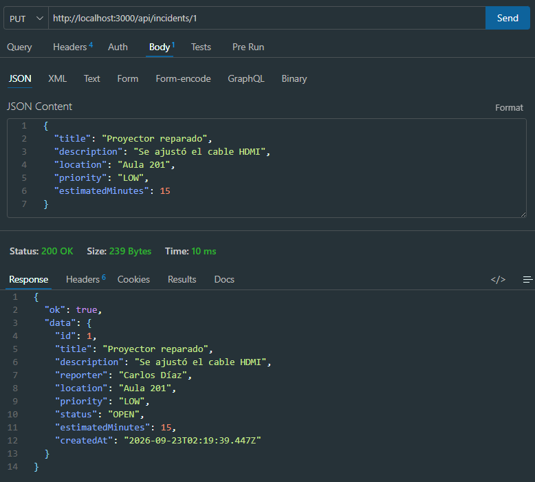

---

### 7.2 PUT inexistente

**Explicación:** verifica el manejo de error cuando se intenta actualizar un incidente cuyo `id` no existe en los datos.

**Configuración en Thunder Client:**

- **Method:** `PUT`
- **URL:** `http://localhost:3000/api/incidents/999`
- **Headers:**
  - `Content-Type: application/json`
- **Body → JSON:**

```json
{
  "title": "Incidente fantasma",
  "description": "Este incidente no existe en la base de datos",
  "location": "Ubicación desconocida",
  "priority": "LOW",
  "estimatedMinutes": 15
}
```

**Resultado esperado:** `404 Not Found`

**Resultado obtenido:** `404 Not Found` — `43 Bytes` — `10 ms`

```json
{
  "ok": false,
  "message": "Incident not found"
}
```

**Evidencia:**

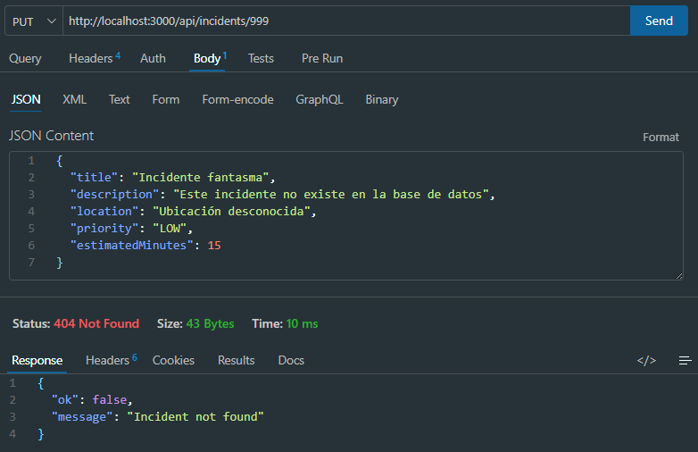

---

## 8. Pruebas de Cambio de Estado (PATCH)

### 8.1 PATCH OPEN → IN_PROGRESS

**Explicación:** valida una transición de estado permitida según la máquina de estados definida en el Reto 5.

**Configuración en Thunder Client:**

- **Method:** `PATCH`
- **URL:** `http://localhost:3000/api/incidents/1/status`
- **Headers:**
  - `Content-Type: application/json`
- **Body → JSON:**

```json
{
  "status": "IN_PROGRESS"
}
```

**Resultado esperado:** `200 OK`

**Resultado obtenido:** `200 OK` — `246 Bytes` — `6 ms`

```json
{
  "ok": true,
  "data": {
    "id": 1,
    "title": "Proyector reparado",
    "description": "Se ajustó el cable HDMI",
    "reporter": "Carlos Díaz",
    "location": "Aula 201",
    "priority": "LOW",
    "status": "IN_PROGRESS",
    "estimatedMinutes": 15,
    "createdAt": "2026-09-23T02:19:39.447Z"
  }
}
```

**Evidencia:**

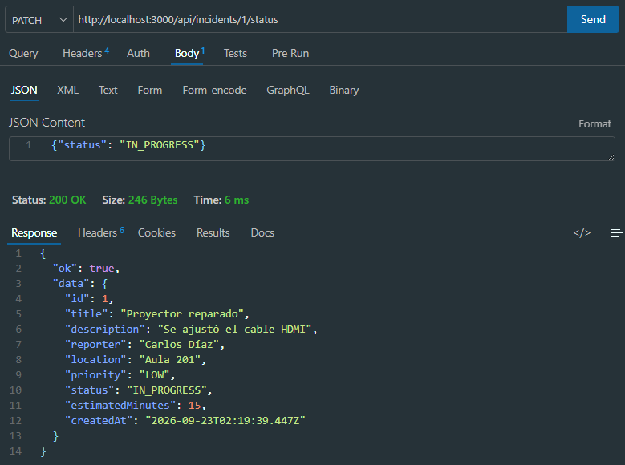

---

### 8.2 PATCH IN_PROGRESS → RESOLVED

**Explicación:** valida la segunda transición permitida: de `IN_PROGRESS` a `RESOLVED`.

**Configuración en Thunder Client:**

- **Method:** `PATCH`
- **URL:** `http://localhost:3000/api/incidents/1/status`
- **Headers:**
  - `Content-Type: application/json`
- **Body → JSON:**

```json
{
  "status": "RESOLVED"
}
```

**Resultado esperado:** `200 OK`

**Resultado obtenido:** `200 OK` — `243 Bytes` — `9 ms`

```json
{
  "ok": true,
  "data": {
    "id": 1,
    "title": "Proyector reparado",
    "description": "Se ajustó el cable HDMI",
    "reporter": "Carlos Díaz",
    "location": "Aula 201",
    "priority": "LOW",
    "status": "RESOLVED",
    "estimatedMinutes": 15,
    "createdAt": "2026-09-23T02:19:39.447Z"
  }
}
```

**Evidencia:**

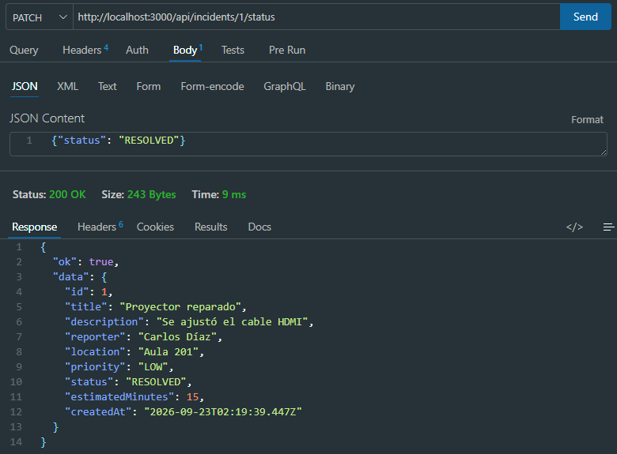

---

### 8.3 PATCH RESOLVED → OPEN (Reto 5)

**Explicación:** confirma que la transición inversa **no permitida** (de `RESOLVED` a `OPEN`) es rechazada por la lógica del Reto 5. Se ejecuta justo después de la prueba 8.2, cuando el incidente ya está en estado `RESOLVED`.

**Configuración en Thunder Client:**

- **Method:** `PATCH`
- **URL:** `http://localhost:3000/api/incidents/1/status`
- **Headers:**
  - `Content-Type: application/json`
- **Body → JSON:**

```json
{
  "status": "OPEN"
}
```

**Resultado esperado:** `400 Bad Request`

**Resultado obtenido:** `400 Bad Request` — `71 Bytes` — `7 ms`

```json
{
  "ok": false,
  "message": "Invalid state transition from RESOLVED to OPEN"
}
```

**Evidencia:**

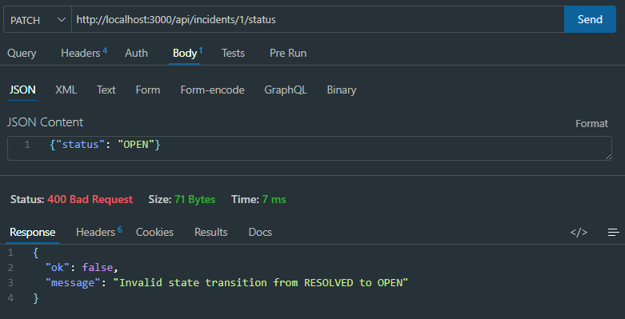

---

## 9. Pruebas de Eliminación y Seguridad (DELETE)

### 9.1 DELETE sin token

**Explicación:** comprueba que el middleware de autenticación bloquea cualquier intento de eliminación que no incluya el encabezado `Authorization`.

**Configuración en Thunder Client:**

- **Method:** `DELETE`
- **URL:** `http://localhost:3000/api/incidents/2`
- **Headers:** ninguno
- **Body:** ninguno

**Resultado esperado:** `401 Unauthorized`

**Resultado obtenido:** `401 Unauthorized` — `70 Bytes` — `7 ms`

```json
{
  "ok": false,
  "message": "Unauthorized: Missing or invalid token format"
}
```

**Evidencia:**

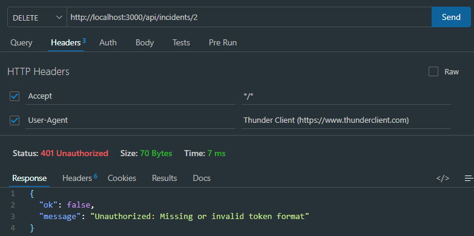

---

### 9.2 DELETE con technician-token

**Explicación:** valida que el middleware de autorización de administrador bloquea la eliminación cuando el token pertenece a un técnico (rol sin permisos de borrado).

**Configuración en Thunder Client:**

- **Method:** `DELETE`
- **URL:** `http://localhost:3000/api/incidents/2`
- **Headers:**
  - `Authorization: Bearer technician-token`

**Resultado esperado:** `403 Forbidden`

**Resultado obtenido:** `403 Forbidden` — `65 Bytes` — `10 ms`

```json
{
  "ok": false,
  "message": "Forbidden: Administrator access required"
}
```

**Evidencia:**

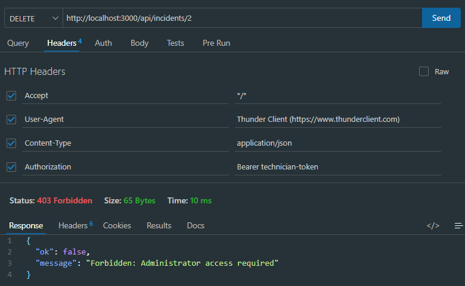

---

### 9.3 DELETE con instructor-token

**Explicación:** confirma que un usuario con rol de administrador (`instructor-token`) sí puede eliminar un incidente correctamente.

**Configuración en Thunder Client:**

- **Method:** `DELETE`
- **URL:** `http://localhost:3000/api/incidents/2`
- **Headers:**
  - `Authorization: Bearer instructor-token`

**Resultado esperado:** `204 No Content` (sin cuerpo de respuesta)

**Resultado obtenido:** `204 No Content` — `0 Bytes` — `10 ms` _(respuesta vacía, sin cuerpo JSON, tal como lo exige la especificación)_

**Evidencia:**

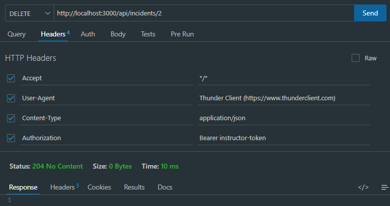

---

## 10. Pruebas de Rutas Especiales y Errores Globales

### 10.1 Ruta inexistente

**Explicación:** verifica que el middleware 404 global responde de forma controlada ante cualquier ruta que no esté definida en la aplicación.

**Configuración en Thunder Client:**

- **Method:** `GET`
- **URL:** `http://localhost:3000/api/planets`
- **Headers:** ninguno
- **Body:** ninguno

**Resultado esperado:** `404 Not Found`

```json
{
  "ok": false,
  "message": "Route not found"
}
```

**Resultado obtenido:** `404 Not Found` — `40 Bytes` — `10 ms`

```json
{
  "ok": false,
  "message": "Route not found"
}
```

**Evidencia:**

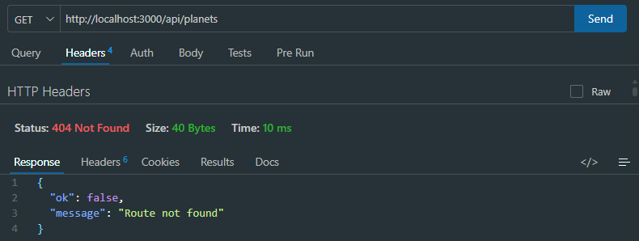

---

### 10.2 GET /critical (Reto 1)

**Explicación:** valida que la bandeja de incidentes críticos (Reto 1) retorna únicamente los incidentes con `priority: "CRITICAL"`, junto con el total.

**Configuración en Thunder Client:**

- **Method:** `GET`
- **URL:** `http://localhost:3000/api/incidents/critical`
- **Headers:** ninguno
- **Body:** ninguno

**Resultado esperado:** `200 OK`, con `total` y `data` filtrados por `priority: "CRITICAL"`.

**Resultado obtenido:** `200 OK` — `310 Bytes` — `8 ms`

```json
{
  "ok": true,
  "total": 1,
  "data": [
    {
      "id": 4,
      "title": "Servidor local sin acceso SSH",
      "description": "El nodo de pruebas principal rechaza las conexiones remotas.",
      "reporter": "Ana Gomez",
      "location": "Sala de Servidores",
      "priority": "CRITICAL",
      "status": "OPEN",
      "estimatedMinutes": 50,
      "createdAt": "2026-09-23T02:19:39.450Z"
    }
  ]
}
```

**Evidencia:**

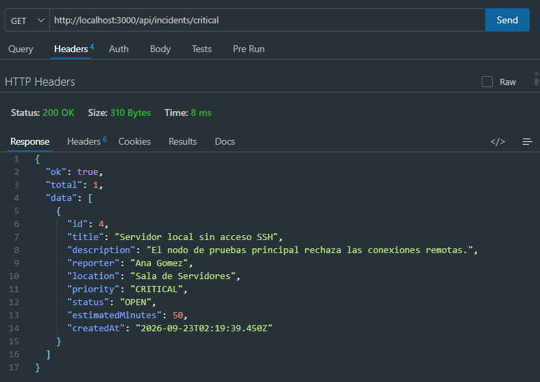

---

### 10.3 GET /stats (Reto 3)

**Explicación:** confirma que el resumen operacional (Reto 3) calcula dinámicamente las métricas a partir de los datos actuales, sin valores escritos manualmente.

**Configuración en Thunder Client:**

- **Method:** `GET`
- **URL:** `http://localhost:3000/api/incidents/stats`
- **Headers:** ninguno
- **Body:** ninguno

**Resultado esperado:** `200 OK`

```json
{
  "ok": true,
  "data": {
    "total": 12,
    "open": 5,
    "inProgress": 4,
    "resolved": 3,
    "critical": 2,
    "averageEstimatedMinutes": 47
  }
}
```

**Resultado obtenido:** `200 OK`

```json
{
  "ok": true,
  "data": {
    "total": 12,
    "open": 5,
    "inProgress": 4,
    "resolved": 3,
    "critical": 2,
    "averageEstimatedMinutes": 47
  }
}
```

**Evidencia:**

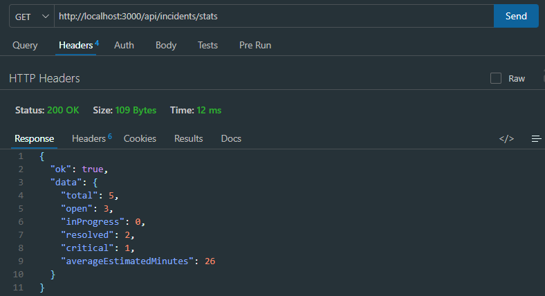

## 11. Conclusiones

Durante el desarrollo y la ejecución de las pruebas para la **IncidentHub API**, se consolidaron conceptos fundamentales sobre la arquitectura por capas en Node.js y TypeScript, permitiendo comprender a profundidad cómo fluye una petición HTTP desde que ingresa al servidor hasta que genera una respuesta validada. 

Entre los principales aprendizajes destacan:
* **Validación robusta con Middlewares:** Se evidenció la importancia de interceptar las peticiones mediante middlewares personalizados (como la validación de IDs, campos obligatorios, restricciones de tiempo y prioridades en los retos). Esto asegura que los controladores solo reciban información limpia y estructurada, desacoplando la lógica de negocio de las reglas de validación.
* **Control centralizado de errores:** La implementación de un manejador global de errores basado en una clase personalizada (`AppError`) simplificó considerablemente las respuestas HTTP. En lugar de manejar bloques `try-catch` repetitivos en cada endpoint, el sistema estandarizó los códigos de estado (como 400, 404, 401, 403 y 500) y los mensajes de error en formato JSON de manera unificada.
* **Pruebas de seguridad y estados:** Configurar herramientas como **Thunder Client** facilitó la comprobación de escenarios complejos, tales como el bloqueo de rutas por falta de roles de administrador, la limitación en la máquina de estados de los incidentes y el cumplimiento de las reglas de negocio especiales (Retos 1, 3, 4 y 5). 

Como principal dificultad durante el proceso, se presentó la correcta administración de los encabezados de autorización (`Authorization: Bearer ...`) al cambiar dinámicamente entre roles de técnicos e instructores, lo cual exigió un alto nivel de atención en la configuración de las cabeceras HTTP para evitar respuestas falsas de tipo 401 o 403. No obstante, esto reforzó la comprensión sobre la seguridad en APIs RESTful.
